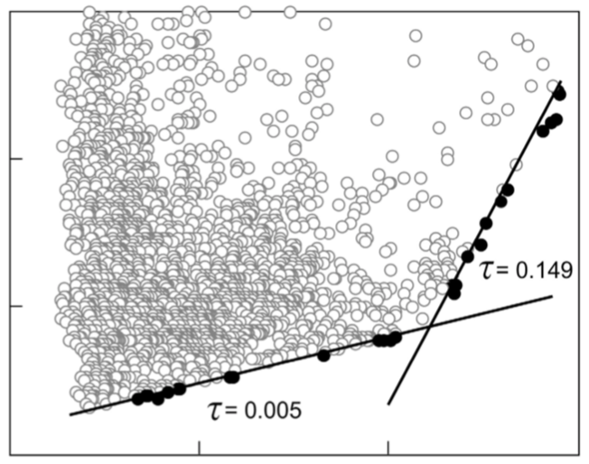

```{r setup, include=FALSE}
knitr::opts_chunk$set(echo = FALSE,
                      warning = FALSE)
library(breath)
library(quantreg)
library(tidyverse)
```

```{r}
n_days <- last(bm181021_dives$data$dt) - first(bm181021_dives$data$dt)
n_dives <- bm181021_dives$data %>% 
  filter(diveid > 0) %>% 
  summarize(n = n_distinct(diveid)) %>% 
  pull(n)
n_breaths <- sum(bm181021_dives$data$is_breath)
n_lunges <- length(bm181021_dives$lunge_dt)
```

This analysis focuses on medium-term deployment **bm181021**, which lasted `r format(n_days, digits = 1)` days and included `r n_dives` dives, `r n_lunges` lunges, and `r n_breaths` breaths.

Here's an example of a dive event after breath and dive identification.

```{r}
plot_dive_event(bm181021_dives, 200, 60)
```

When an animal dives beyond its aerobic dive limit (ADL), we expect dives *shorter* than the ADL all have the same minimum recovery time and *longer* dives have an increasing minimum recovery time. For details, see Horning (2012).



This whale shows the opposite trend, i.e. the minimum recovery time is increasing for dives shorter than the breakpoint and flat for longer. I think this means the animal is not approaching the ADL so we lack data on sufficiently long dives.

```{r}
fit_adl(bm181021_dives) %>%
  plot_adl()
```

This trend holds when we average duration and recovery over 6 dives.

```{r}
fit_adl(bm181021_dives, n_dives = 6) %>%
  plot_adl()
```
